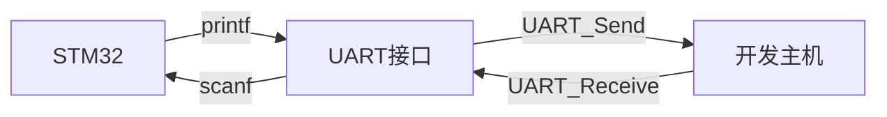

当我们进行试验时，你也许会发现STM32的调试十分困难，很多时候你只能不停地对照例程、修改代码，而不知道程序错在了哪里，那么这一节，我们将暂停外设的学习，来看看如何方便快捷的调试STM32程序。

首先我们来谈谈STM32的调试有哪些特别之处：

* 与51单片机不同，STM32基于ARM架构，支持先进的调试功能，可以进行在线仿真，搭配gdb可以实现断点、单步执行、监视寄存器和内存等高级调试功能；
* 与在计算机编程不同，STM32本身没有显示屏、键盘等输出和输入设备，我们无法直接通过`printf`输出日志信息。

基于以上两个特点，本节将介绍gdb调试和Semihosting（半主机模式）两种常用的STM32的调试方法。

## gdb调试

当我们烧写程序时，OpenOCD会通过SWD调试接口创建一个gdb服务器，在第一节中，我们已经尝试了一下这个功能，本节我们将更加详细的介绍cortex-debug工具的使用。

让我们从配置文件说起吧：

```json
{
    "version": "0.2.0",
    "configurations": [
        {
            "cwd": "${workspaceRoot}",
            "type": "cortex-debug",
            "request": "launch",
            "name": "openocd",
            "servertype": "openocd",
            "executable": "build\\Debug\\gpio.elf",
            "runToEntryPoint": "main",
            "configFiles": [
                "interface/stlink.cfg",
                "target/stm32f1x.cfg"
            ],
            "toolchainPrefix": "arm-none-eabi",
            "svdFile": ".pack/Keil/STM32F1xx_DFP.2.3.0/SVD/STM32F103xx.svd"
        }
    ]
}
```

这是VSCode中的debug选项配置文件`launch.json`，通过配置该文件，我们可以在Debug选项中创建一个名为openocd的调试选项，执行该Debug命令，插件会自动将可执行文件烧写入STM32并打开gdb调试器，重点说明如下几个设置项：

* `"executable"`：该选项是调试所用的二进制可执行文件，该文件不为`.elf`格式，与`.hex`相比，`elf`文件不仅包含代码段、数据段、符号表、重定位信息等程序运行必要的信息，还有更多的调试和符号信息，使得调试器能够更好地理解程序，为我们提供更丰富的调试功能；
* `"configFiles"`：这是OpenOCD的配置项，通常需要选择调试器和目标芯片两个选项，根据所用调试器和开发板STM32芯片名称选择即可；
* `"svdFile"`：来自芯片支持包内的寄存器信息，方便插件映射寄存器地址到名称，使我们能够更方便的定位寄存器信息。


运行调试，让我们来介绍一下常用的功能块：

* 顶部调试栏：依次为重置设备、运行、单步运行、步入、步出、重启程序，他们的功能和调试常规C程序一致，需要说明的是重置设备相当于让STM32进行System Reset，而重启程序仅仅是清空寄存器和内存，并跳转至程序开头；
* Variables：显示当前运行状态的变量，其中Local是正在执行函数内的局部变量，Global是全局变量，Static为常量，Register内则是Arm核内的寄存器信息，对于变量，我们不仅可以查看，还可以双击即时更改变量的值；
* Watch：可以在该栏中添加某些特定变量以监视其值变化；
* Call Stack：显示当前执行的调用栈，由于寻找当前语句的上下文，知道当前语句是由谁调用、调用后应返回哪里；
* Breakpoints：管理断点，可以实时添加、删除、临时启用或禁用断点；
* Xperipherals：**最为重要的一栏**，显示了各个外设寄存器的名称和值，对于可以写的寄存器，还可以实时修改寄存器的值，同时，当值发生变化时，该寄存器会高亮显示。

当然，如果你十分熟悉gdb的使用，下方的Debug Terminal中也可以直接执行gdb语句。

## Semihosting

半主机模式是嵌入式调试中的一个重要技术，它通过嵌入式设备与开发主机系统的通信，将嵌入式设备的标准输入输出、文件读写重定向至主机，提供了一种在嵌入式系统中进行调试和交互的手段，填补了嵌入式设备显示输出设备的缺失。

在C语言中，通常使用`stdio.h`中的`printf`与`scanf`函数进行与程序的输入输出交互，如果在STM32程序中调用该函数，编译烧写不会有任何显示，这是由于我们在编译时默认使用了`--specs=nano.specs`参数，它会调用嵌入式系统使用的精简后的`libc_nano`库，其中并未提供标准输入输出实现，还记得我们在第一次编译链接时遇到的Warning么：

```
../arm-none-eabi/bin/ld.exe: ../lib/gcc/arm-none-eabi/13.2.1/thumb/v7-m/nofp\libc_nano.a(libc_a-closer.o): in function `_close_r':
closer.c:(.text._close_r+0xc): warning: _close is not implemented and will always fail
../arm-none-eabi/bin/ld.exe: ../lib/gcc/arm-none-eabi/13.2.1/thumb/v7-m/nofp\libc_nano.a(libc_a-lseekr.o): in function `_lseek_r':
lseekr.c:(.text._lseek_r+0x10): warning: _lseek is not implemented and will always fail
../arm-none-eabi/bin/ld.exe: ../lib/gcc/arm-none-eabi/13.2.1/thumb/v7-m/nofp\libc_nano.a(libc_a-readr.o): in function `_read_r':
readr.c:(.text._read_r+0x10): warning: _read is not implemented and will always fail
../arm-none-eabi/bin/ld.exe: ../lib/gcc/arm-none-eabi/13.2.1/thumb/v7-m/nofp\libc_nano.a(libc_a-writer.o): in function `_write_r':
writer.c:(.text._write_r+0x10): warning: _write is not implemented and will always fail
```

在加入`printf`语句后，还会多出两条：

```
../arm-none-eabi/bin/ld.exe: ../lib/gcc/arm-none-eabi/13.2.1/thumb/v7-m/nofp\libc_nano.a(libc_a-fstatr.o): in function `_fstat_r':
fstatr.c:(.text._fstat_r+0xe): warning: _fstat is not implemented and will always fail
../arm-none-eabi/bin/ld.exe: ../lib/gcc/arm-none-eabi/13.2.1/thumb/v7-m/nofp\libc_nano.a(libc_a-isattyr.o): in function `_isatty_r':
isattyr.c:(.text._isatty_r+0xc): warning: _isatty is not implemented and will always fail
```

这些Warning语句是告诉我们，`libc_nano`中并未实现这些有关输入输出的函数，我们需要手动实现这些函数，先来看看它们的功能：

* `int _read(int f, char *ptr, int len);`

  从输入流`f`中读取字符串到`ptr`出，最大长度为`len`，返回读入的长度，出错时返回`-1`；

* `int _write(int f, char *ptr, int len);`

  向输出流`f`中写入一个`ptr`处长度为`len`的字符串，返回输出的长度，出错时返回`-1`；

* `int _lseek(int f, int ptr, int dir);`

  移动读写指针到输入输出流`f`的指定位置，向`dir`方向移动`ptr`，返回移动后的偏移量，出错时返回`-1`；

* `int _close(int f);`

  关闭输入输出流`f`，成功返回`0`，失败返回`-1`；

* `int _isatty(int f);`

  判断输入输出流`f`是否关联到终端设备，若关联返回非零值，否则返回`0`；

* `int _fstat(int f, struct stat *st);`

  将文件`f`信息写入`st`，成功写入返回`0`，出错返回`1`。

将这些函数的输入输出重定向至开发主机有多种方式，例如使用[SWD的SVC命令](https://interrupt.memfault.com/blog/arm-semihosting)进行，但作者研究了好久没有成功，于是作者选择了使用UART接口的方式实现Semihosting，具体原理如下：



我们使用USART1外设来实现STM32与开发主机间的通信，由于我们尚未完成USART外设的学习，这里我们仅仅给出实现代码，不做过多说明，感兴趣的话可以配合注释进行学习，代码中只实现了标准输入输出的重定向，需要注意，在输入时我们使用了阻塞式的输入方法，当调用`scanf`时，如果输入不满足格式要求，会一直阻塞在`read`函数的循环中：


```c
#include "stm32f10x.h"

#include <errno.h>
#include <sys/stat.h>
#include <stdio.h>

#define STDIN_FILENO  0
#define STDOUT_FILENO 1
#define STDERR_FILENO 2

void Semihosting_Init(void)
{
    // UART1复用引脚PA9（TX）、PA10（RX），需要开启AFIO、GPIOA与UART1时钟
    RCC_APB2PeriphClockCmd(RCC_APB2Periph_AFIO | RCC_APB2Periph_GPIOA | RCC_APB2Periph_USART1, ENABLE);

    // 配置USART_TX（PA9）为Alternate function push-pull
    GPIO_InitTypeDef GPIO_InitStructure;
    GPIO_InitStructure.GPIO_Pin   = GPIO_Pin_9;
    GPIO_InitStructure.GPIO_Mode  = GPIO_Mode_AF_PP;
    GPIO_InitStructure.GPIO_Speed = GPIO_Speed_50MHz;
    GPIO_Init(GPIOA, &GPIO_InitStructure);

    // 配置USART_RX（PA10）为 Input floating
    GPIO_InitStructure.GPIO_Pin  = GPIO_Pin_10;
    GPIO_InitStructure.GPIO_Mode = GPIO_Mode_IN_FLOATING;
    GPIO_Init(GPIOA, &GPIO_InitStructure);

    // 配置USART1
    USART_InitTypeDef USART_InitStructure;
    USART_InitStructure.USART_BaudRate            = 115200;
    USART_InitStructure.USART_WordLength          = USART_WordLength_8b;
    USART_InitStructure.USART_StopBits            = USART_StopBits_1;
    USART_InitStructure.USART_Parity              = USART_Parity_No;
    USART_InitStructure.USART_Mode                = USART_Mode_Rx | USART_Mode_Tx;
    USART_InitStructure.USART_HardwareFlowControl = USART_HardwareFlowControl_None;
    USART_Init(USART1, &USART_InitStructure);

    // 使能USART1
    USART_Cmd(USART1, ENABLE);

    // 禁用缓冲区，一有输出立即发送
    setvbuf(stdout, NULL, _IONBF, 0);
}

// 标准输入通过UART_ReceiveData读入，每次仅能读取一个字符
int _read(int f, char *ptr, int len)
{
    if (f == STDIN_FILENO) {
        while (USART_GetFlagStatus(USART1, USART_FLAG_RXNE) == RESET)
            ;
        ptr[0] = USART_ReceiveData(USART1);
        return 1;
    }
    errno = EBADF;
    return -1;
}

// 标准输出通过UART_SendData逐字符发出
int _write(int f, char *ptr, int len)
{
    if (f == STDOUT_FILENO || f == STDERR_FILENO) {
        int i;
        for (i = 0; i < len; i++) {
            USART_SendData(USART1, ptr[i]);
            while (USART_GetFlagStatus(USART1, USART_FLAG_TXE) == RESET)
                ;
        }
        return len;
    }
    errno = EBADF;
    return -1;
}

// 禁用读写指针移动
int _lseek(int f, int ptr, int dir)
{
    (void)f;
    (void)ptr;
    (void)dir;

    errno = EBADF;
    return -1;
}

// 假关闭，直接返回关闭成功
int _close(int f)
{
    if (f >= STDIN_FILENO && f <= STDERR_FILENO)
        return 0;

    errno = EBADF;
    return -1;
}

// 仅标准输入输出与终端绑定，其余均不可用
int _isatty(int f)
{
    if (f >= STDIN_FILENO && f <= STDERR_FILENO)
        return 1;

    errno = EBADF;
    return 0;
}

// 标准输入输出为显示字符的终端设备，其余输入输出无信息
int _fstat(int f, struct stat *st)
{
    if (f >= STDIN_FILENO && f <= STDERR_FILENO) {
        st->st_mode = S_IFCHR;
        return 0;
    }

    errno = EBADF;
    return 0;
}
```

此时引入该头文件，并在主函数开头初始化Semihosting接口，即可在后续程序中使用`printf`与`scanf`函数了，输入输出可通过串口调试小助手进行，串口助手的配置需要与`USART_InitStructure`中配置一致，这里推荐使用VS Code中的[Serial Monitor](https://marketplace.visualstudio.com/items?itemName=ms-vscode.vscode-serial-monitor)插件，这样我们可以在VS Code中实现一站式开发。


## 其他调试方法

在江协科技的教程中，推荐使用LED显示屏将调试信息打印到屏幕上进行输出，但我更加喜欢这种配合串口的调试方式，一则LED显示屏没有记录功能，二则显示内容有限，不如通过串口打印至主机来得方便，不过萝卜青菜各有所爱，如果你更加喜欢外接屏幕显示输出的方案，可以参照B站教程进行学习。

在本节教程中，我们简单介绍了gdb调试和输入输出调试的实现及使用，在下一节中，我们将继续学习STM32的外设使用。
