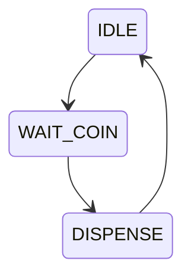
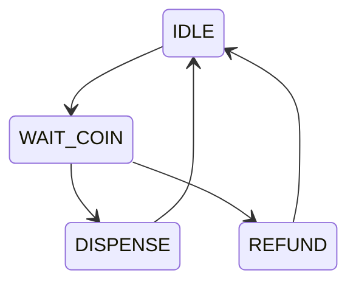
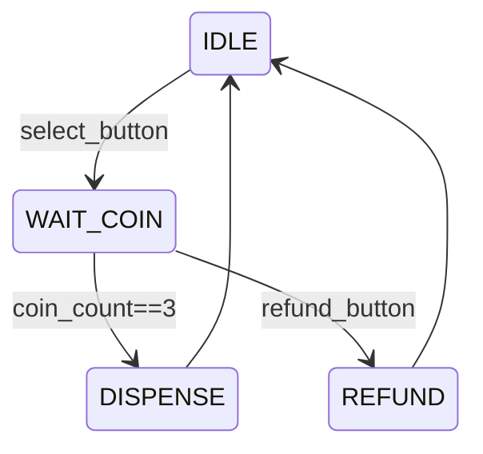
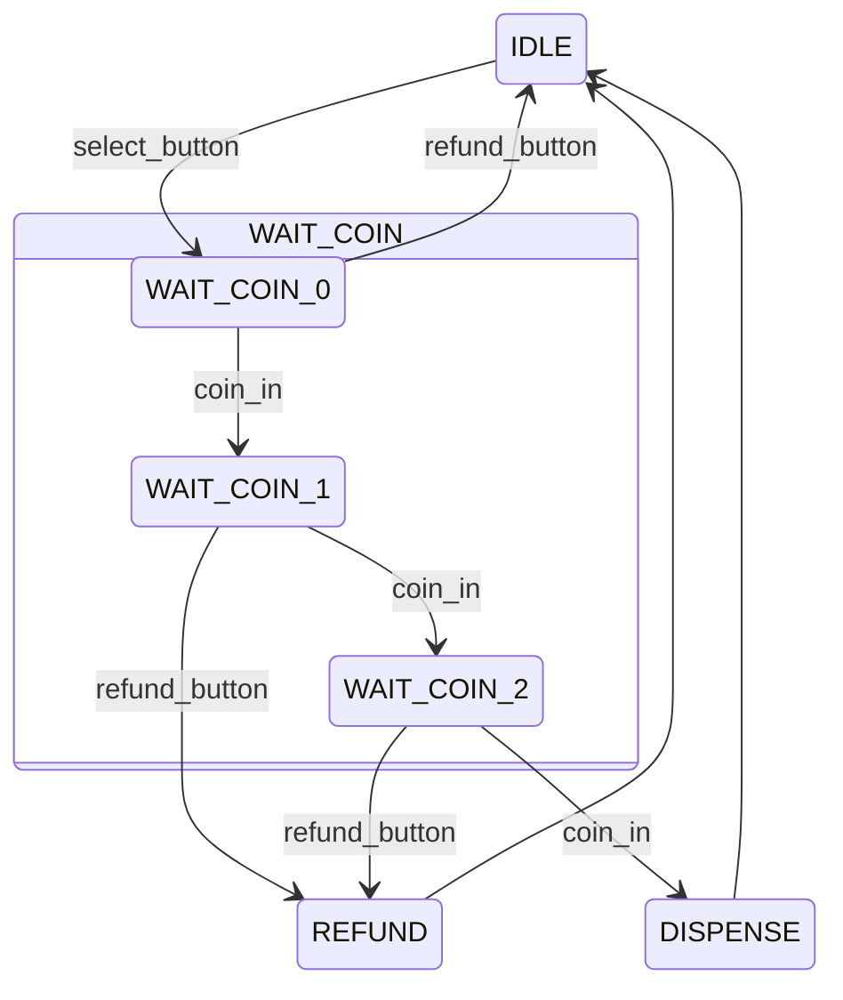

## 引子

按照原计划，这篇文章应该介绍oss-cad-suite的使用。不幸的是，三天前我突然发现开发板上的DDR芯片异常发热，即使不进行读写操作，静态电流也超过200mA，需要返厂检修（检查后我决定自行更换DDR），由于手头没有可用于烧录演示的开发板，因此决定提前介绍一些常用的SystemVerilog模块最佳实践。

第一个主题是有限状态机（FSM），它是数字电路设计中最重要的模型之一，是理解和构建所有时序逻辑电路的基石，也是数字电路设计的“灵魂”所在。

本文介绍的最佳实践源自Verilog标准制定者之一的Clifford Cummings大佬，原文是其在[Sunburst Design](http://www.sunburst-design.com/)公司网站上公开的文章”[Finite State Machine (FSM) Design & Synthesis using SystemVerilog - Part I](http://www.sunburst-design.com/papers/CummingsSNUG2019SV_FSM1.pdf)“，感兴趣的读者可以直接阅读原文。

## 场景

让我们从一个简单例子开始，想象一台自动售货机，只出售一种售价3元的饮料，且仅接受1元硬币支付，用户首先选择商品，然后进行投币，当金额足够时，便会吐出一瓶饮料，在出货前的任意时刻，用户可以点击退款按钮退还投入的硬币并重新购买。

在设计这个状态机前，我们需要先明确售货机的基本功能需求：

* **选择商品**：需要为用户提供一个按钮选择购买饮料；
* **接收投币**：接收用户投入的1元硬币；
* **累计金额**：能够记录当前投入的总金额；
* **售出商品**：当总金额达到3元后，出货一瓶饮料；
* **退款**：用户可以随时选择退还已投币。

## 状态机设计

有限状态机由以下几个核心部分组成：

* **状态**：系统只可能存在有限的几种情况；
* **转换**：系统状态的切换过程；
* **事件**：用于改变系统状态的信号；
* **动作**：系统在不同状态下执行的操作。

对于这个我们想象的这个简单的售货机，可以定义以下几个状态：

* **空闲状态**（`IDLE`）：售货机等待顾客选择商品；
* **等待投币状态**（`WAIT_COIN`）：已选择商品，等待用户投币，并记录投币数量；
* **出货状态**（`DISPENSE`）：机器出货；
* **退款状态**（`REFUND`）：机器退款。

接下来，我们再来思考状态间的转换模式，对于用户的一次成功购买，状态的顺序为：



而如果用户在投币过程中选择了退款，将会加入一条新状态转换路径，变为：



至此，该售货机的全部状态转换过程已明确。接下来，我们需要思考状态转换的条件，即“事件”。，从场景中我们可以指导，这台售货机至少要有两个按钮：商品选择按钮（`select_button`）和退款按钮（`refund_button`），他们分别控制售货机状态由空闲转为等待投币和由投币转向退款；此外，这个售货机还需要一个投币口，我们用一个`coin_in`信号表示有硬币投入，不妨假设每个时钟周期，只能完成一次投币，即投入一元；为了记录投币数，我们需要一个`coin_count`计数器记录已投币的数量，当`coin_count==3`时，便会出货一瓶饮料，即售货机状态由等待投币状态转为出货状态。出货和退款都可已在一个时钟周期内完成，因此出货状态和退款状态转换回空闲状态会在下一个周期自动进行。

我们在状态机流程图上添加这些条件：



或者，如果我们不使用计数器，而使用状态表示已投币的数量，状态图将细化成这个样子：



最后，我们需要思考每个状态下需要完成的动作：

* 在`DISPENSE`状态，售货机需要控制出货，可以用`dispense_item`信号表示；
* 在`REFUND`状态，售货机需要驱动退币装置，退还已投入的硬币，用`return_coins`信号表示；
* 在其它状态，售货机不进行任何动作。

## 最佳实践

我们推荐使用三段式状态机来实现有限状态机，三段式是指：

1. 第一段：同步时序逻辑，用于进行**状态转换**；
2. 第二段：组合逻辑，用于基于**事件判断**下一状态；
3. 第三段：输出逻辑，表示在某一状态下的**动作**；

我们用上面的售货机例子来详细看一下这一最佳实践的具体实现：

```systemverilog
module vending_machine (
    input logic clk,   // 时钟信号
    input logic rst_n, // 异步复位，低电平有效

    input logic select_button,  // 选择商品按钮
    input logic refund_button,  // 退款按钮
    input logic coin_in,        // 硬币投入检测（每个硬币一个脉冲）

    output logic dispense_item,  // 出货信号
    output logic return_coins    // 退币信号
);

  // 定义自动售货机的状态
  typedef enum {
    IDLE,         // 空闲状态，等待选择或投入硬币
    WAIT_COIN_0,  // 已选择商品，等待投入第一个硬币
    WAIT_COIN_1,  // 已收到第一个硬币，等待投入第二个硬币
    WAIT_COIN_2,  // 已收到第二个硬币，等待投入第三个硬币
    DISPENSE,     // 出货状态
    REFUND,       // 退币状态
    XXX           // 未定义/错误状态
  } state_e;

  state_e state, next;  // 当前状态和下一个状态寄存器

  // 时序逻辑进行状态转换
  always_ff @(posedge clk or negedge rst_n)
    if (!rst_n) state <= IDLE;  // 复位时进入空闲状态
    else 		state <= next;  // 在时钟上升沿更新状态

  // 组合逻辑判断下一状态
  always_comb begin
    next = XXX;
      case (state)
      IDLE:
      if (select_button)		next = WAIT_COIN_0; // 如果按下选择按钮，进入等待第一个硬币状态
      else 						next = IDLE;  		// 否则保持空闲状态
      WAIT_COIN_0:
      if (coin_in) 				next = WAIT_COIN_1; // 如果收到硬币，进入等待第二个硬币状态
      else if (refund_button) 	next = IDLE;  		// 如果按下退款按钮，返回空闲状态
      else 						next = WAIT_COIN_0; // 否则保持等待第一个硬币状态
      WAIT_COIN_1:
      if (coin_in) 				next = WAIT_COIN_2; // 如果收到硬币，进入等待第三个硬币状态
      else if (refund_button) 	next = REFUND;  	// 如果按下退款按钮，进入退币状态
      else 						next = WAIT_COIN_1; // 否则保持等待第二个硬币状态
      WAIT_COIN_2:
      if (coin_in) 				next = DISPENSE;  	// 如果收到硬币，进入出货状态
      else if (refund_button) 	next = REFUND; 		// 如果按下退款按钮，进入退币状态
      else 						next = WAIT_COIN_2; // 否则保持等待第三个硬币状态
      DISPENSE: 				next = IDLE;  		// 出货完成后，返回空闲状态
      REFUND: 					next = IDLE;  		// 退币完成后，返回空闲状态
      default: 					next = XXX;  		// 所有场景都不满足，进入未预期的状态，便于调试
    endcase
  end

  // 输出逻辑
  always_ff @(posedge clk or negedge rst_n) begin
    if (!rst_n) begin
      dispense_item <= 1'b0;
      return_coins  <= 1'b0;
    end else begin
      dispense_item <= 1'b0;  // 默认不出货
      return_coins  <= 1'b0;  // 默认不退币
      case (next)
        DISPENSE: dispense_item <= 1'b1;  // 在出货状态时，置高出货信号
        REFUND:   return_coins  <= 1'b1;  // 在退币状态时，置高退币信号
        default:  ;
      endcase
    end
  end
endmodule

```

我们可以注意到，三段式状态机将状态转换、事件判断、动作分配到了三个独立的`always`块中，提供了一种可结构严格、可靠且高效的FSM设计方法。虽然代码量相比一些教程中使用的一段式、两段式状态机略多，但其在可读性和可维护性上都具有巨大优势。并且三段式状态机代码中，第一段状态转换块在任何状态机中都无需任何更改，直接复用，代码编写上并不会带来多大的麻烦。

## 补充

### Moore状态机和Mealy状态机

有限状态机可分为Moore和Mealy两种类型，判断依据是输出是否受输入影响。


Moore状态机的输出仅受当前状态控制，每个状态都严格对应着一种输出；而Mealy状态机的输出不仅受状态控制，还与当前时刻的输入信号有关。

我们编写的售货机仿真波形如下图所示，依次模拟了成功购买、投入一枚硬币后退款、投入两枚硬币后退款三个状态，可以注意到，输出信号`dispense_item`和`return_coins`信号在输入信号的下一个时钟周期与当前状态`state`同步变化，输出信号仅受当前状态控制，因此这是一个典型的Moore状态机。可以注意到，当输入操作时，输出会慢上一个时钟周期，这是由于状态寄存器须在时钟上升沿处更新，这也是Moore状态机不可避免的一个延迟。


如果想将这一模型改为Mealy状态机，只需将输出逻辑的`always`块改为组合逻辑，如：

```systemverilog
  // 输出逻辑（更改为组合逻辑）
  always_comb begin
    dispense_item = 1'b0;  // 默认不出货
    return_coins  = 1'b0;  // 默认不退币

    case (next)
      DISPENSE: dispense_item = 1'b1;  // 在出货状态时，置高出货信号
      REFUND:   return_coins  = 1'b1;  // 在退币状态时，置高退币信号
      default:  ;
    endcase
  end
```

此时，我们的仿真波形如下图所示，可以看到输出信号提前了一个时钟周期，当`refund_button`和`coin_in`变化时，输出先于状态完成了改变，变为跟随下一状态`next`变化。


从表面上看，Mealy状态机能够降低延迟，但这也大大降低了模块的抗干扰能力，如下图所示，在第二个测例中，投入一枚硬币后，退款按钮`refund_button`上出现了一个扰动，该扰动立刻反映在了`return_coins`上，这是十分危险的！


因此，除非必要的场合，我们都应该避免使用Mealy状态机。谨记，”**Moore is Less. And Less is Beautiful.**“。

### 输出逻辑判断

在输出逻辑判断时，我们使用的是`next`信号，而不是`state`信号，这里的技巧在于，我们应该判断并赋值的是”下一个“输出的信号值，而不是当前状态的输出信号值。如果在这里错误使用了`state`作为判断信号，则会导致输出相较当前状态存在一个时钟周期的延迟，破坏了Moore状态机输出与状态的对应关系！


### XXX状态

在状态定义中，我们额外定义了一个`XXX`状态。理想状态下，在复位结束后，状态机在任何情况下都不应该进入`XXX`状态。你或许会觉得这一状态没有意义，但在复杂状态机设计中，常常会有我们考虑不到或考虑不全的转换关系，这种情况下，很容易发生程序“跑飞”的现象，`XXX`状态的加入正是为了发现这一未定义状态空间，这将在仿真验证时大大缩短我们的debug时间。

因此，我们在定义状态枚举类时，应定义`XXX`状态，并将其作为状态判断组合逻辑的默认值，当在仿真中发现了`XXX`状态的出现，便需要查找该未定义状态出现的原因，修复这一错误。另外，在枚举类值映射时，可以将`XXX`状态映设为`'x`，这样该状态就会被综合器忽略，也不会占用额外的资源。

### 枚举值映射

在上面的示例代码中，我们没有为`state_e`状态类指定格式，在这种情况下，综合器会根据你的代码，自动选择或推断出最合适的编码方式。编码方式分为"Binary"和"OneHot"两种。


"Binary"采用累加数值进行编码，即状态会编码为0、1、2、3、4……这种编码方式只需要`clog(N)`个触发器即可以表示N种状态，但状态改变的控制逻辑会更为复杂；

"OneHot"则采用仅有一位"1"的二进制数表示不同的状态，即0001、0010、0100、1000……这种编码方式需要N个触发器表示N种状态，但从一个状态切换到另一个状态会非常简单，至多需要两次位翻转即可完成。

总的来说，"Binary"编码节省触发器资源，"OneHot"编码控制逻辑简单。通常来说，FPGA的触发器资源是相当充裕的，并且在相同硬件环境下，"OneHot"因其简单的组合逻辑，能够实现更高的时钟频率，因此，在FPGA设计中一般会优先使用"OneHot"编码方式。

如果需要手动控制编码格式，可以将枚举类定义部分修改为：

```systemverilog
  // 使用"OneHot"编码定义自动售货机的状态
  typedef enum logic [5:0] {
    IDLE        = 6'b000001,  // 空闲状态，等待选择或投入硬币
    WAIT_COIN_0 = 6'b000010,  // 已选择商品，等待投入第一个硬币
    WAIT_COIN_1 = 6'b000100,  // 已收到第一个硬币，等待投入第二个硬币
    WAIT_COIN_2 = 6'b001000,  // 已收到第二个硬币，等待投入第三个硬币
    DISPENSE    = 6'b010000,  // 出货状态
    REFUND      = 6'b100000,  // 退币状态
    XXX         = 'x          // 未定义/错误状态
  } state_e;

```

## 小结

在这篇文章中，我们介绍了有限状态机的设计过程和代码实现，状态机是数字电路的核心架构之一，我们将要设计的处理器本质上就是一个大型状态机结构。熟悉了状态机的构建，才能在理解架构、设计架构时得心应手。Clifford大佬推荐的三段式状态机为我们提供了一个绝佳的状态机模板，本系列文章的后续设计也会严格遵循这一架构展开。
